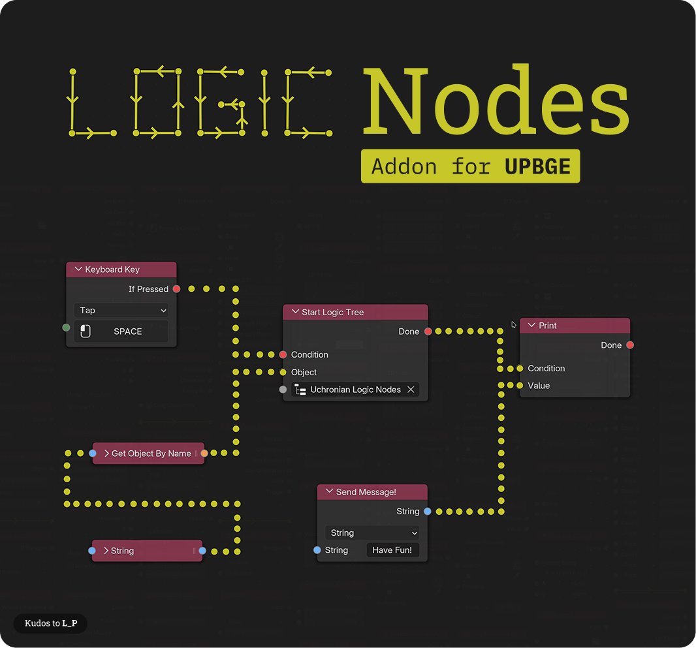

# Uchronian Logic: UPBGE Logic Nodes
A Node-based Logic system for UPBGE 0.3.0+ (Blender 2.8+) and UPBGE 0.2.4+ (Blender 2.79b)

(Header by L_P)

This is an Add-On for the recent UPBGE-EEVEE build.
It adds a new Editor in which you can create logic trees and apply them to objects.

Install:
1. Download
    * Download here: https://github.com/IzaZed/Uchronian-Logic-UPBGE-Logic-Nodes/releases OR
    * clone this repository in a folder named "bge_netlogic" and then zip it whenever you pull.
2. Install
    * In Blender, go to Edit -> Preferences -> Add-Ons and click on "Install Add-On from file...".
3. Load
    * Once loaded, activate the Add-On by clicking on the checkbox to the left.
  
Update:
1. In Preferences, navigate to Add-Ons and deactivate, then remove the Add-On.
2. Download new version or pull and zip
3. Install
    
How to use:
1. In the Editor Selection, go to "Logic Tree Editor".
2. Create a new logic tree just as you would create a Material in the material editor.
3. Select an object in the 3D-Viewport, then click on "apply logic to selected object" in the Logic Tree Editor.

# Discord Server

https://discord.gg/6xmPJ7ZZ69

# If you want to support this project

head over to https://www.patreon.com/iza_zed

Thanks to all who use and support this!